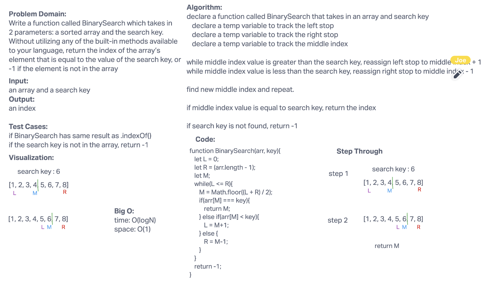

# Binary Search of Sorted Array

Use Binary Search method to serach target value's position, return -1 if it's not found.

## Whiteboard Process

## Approach & Efficiency

Big O:
time: O(logN)
space: O(1)
