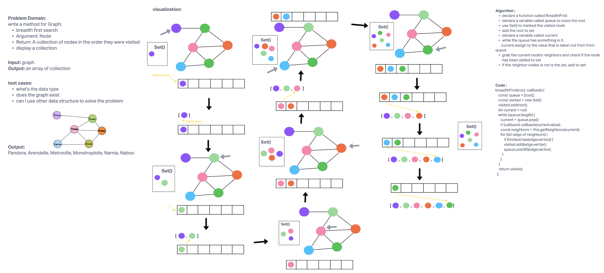

# Challenge Summary

Write the following method for the Graph class:

- breadth first
- Arguments: Node
- Return: A collection of nodes in the order they were visited.
- Display the collection

## Whiteboard Process

## Approach & Efficiency

- time: O(n)
- space: O(n)

## Solution

to run the test, use `npm test graph.test.js`.
