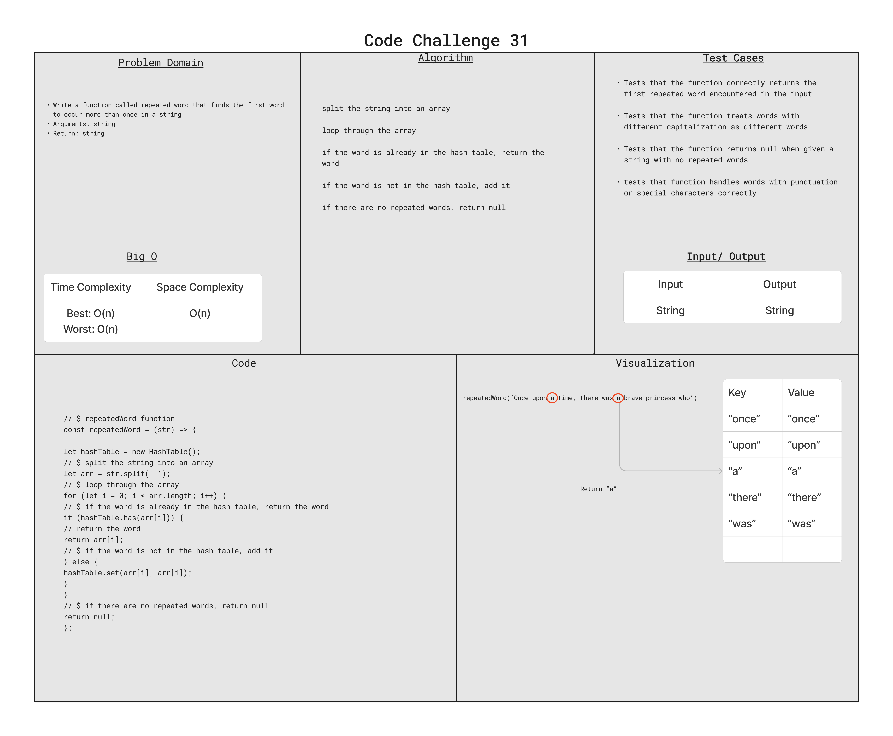

# Challenge Summary

Write a function called repeated word that finds the first word to occur more than once in a string

## Whiteboard Process

## Approach & Efficiency

Big O :

-time: O(n)
-space: O(n)

## Solution

to run the test, use `npm test hashTable.test.js`.
