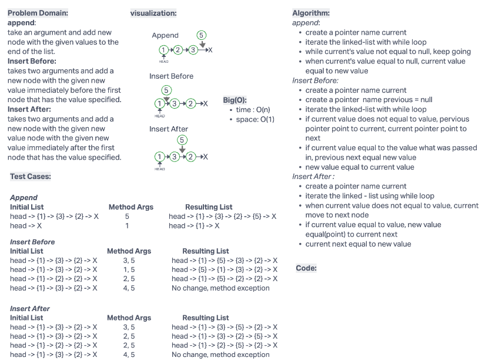

# Linked-list-insertions

append:

- take an argument and add new node with the given values to the end of the list.

Insert Before:

- takes two arguments and add a new node with the given new value immediately before the first node that has the value specified.

Insert After:

- takes two arguments and add a new node with the given new value node with the given new value immediately after the first node that has the value specified.

## Whiteboard Process

## Approach & Efficiency

Big(O):

- time : O(n)
- space: O(1)

## testing

`npm test linked-list`
