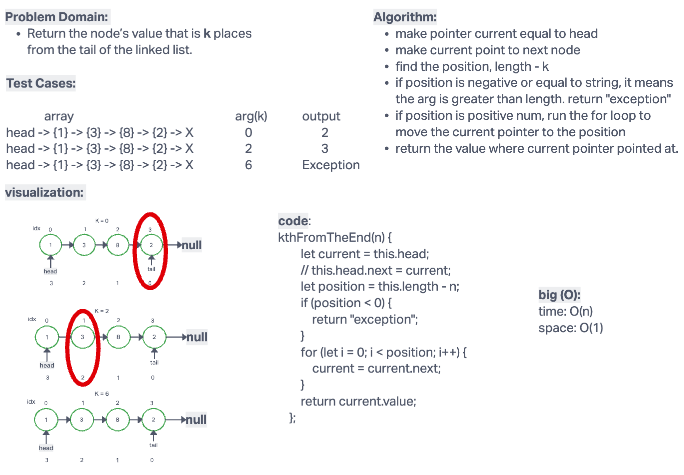

# Challenge Summary

Given a interger K, witch represent the node starting from the end of the linked list. reutrn the value inside the node.

## Whiteboard Process

## Approach & Efficiency

Big (O):
time: O(n)
space: O(n)

## testing

`npm test`
