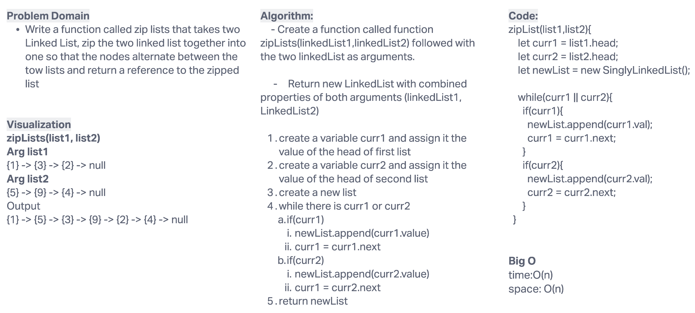

# linked-list-zip

## Problem Domain

Write a function called zip lists that takes two Linked List, zip the two linked list together into one so that the nodes alternate between the tow lists and return a reference to the zipped list

## Whiteboard Process

## Approach & Efficiency

Big(O):

- time: O(n)
- space: O(n)

## testing

`npm test linked-list`