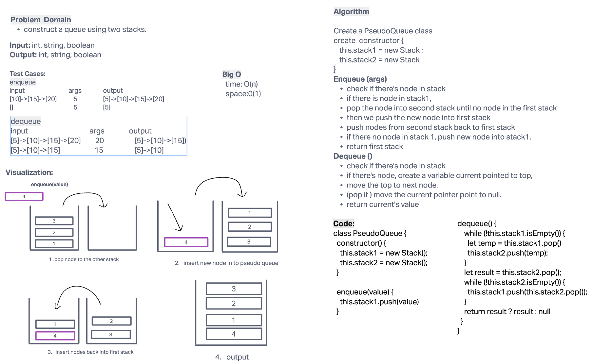

# Challenge Summary

using Stacks data structure to manipulate Queue.

## Whiteboard Process

## Approach & Efficiency

Big O :

- time: O(2n)
- space: O(1)

## Solution

to run the test, use `npm test pseudoQueue.test.js`.
