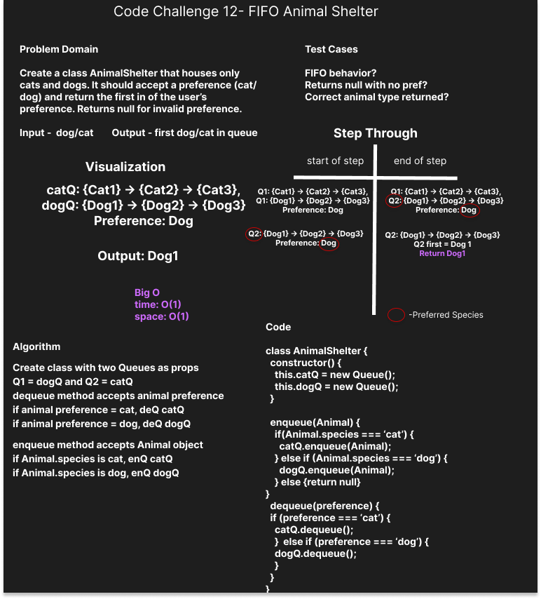

# Challenge Summary

Create a class AnimalShelter that houses only cats and dogs. It should accept a preferece(cat/dog) and return the first cat/dog if user's preference by follow FIFO rule. return the null for invalid preference. 

## Whiteboard Process

## Approach & Efficiency

Big O :

- time: O(1)
- space: O(1)

## Solution

to run the test, use `npm test stack-queue.test.js`.
