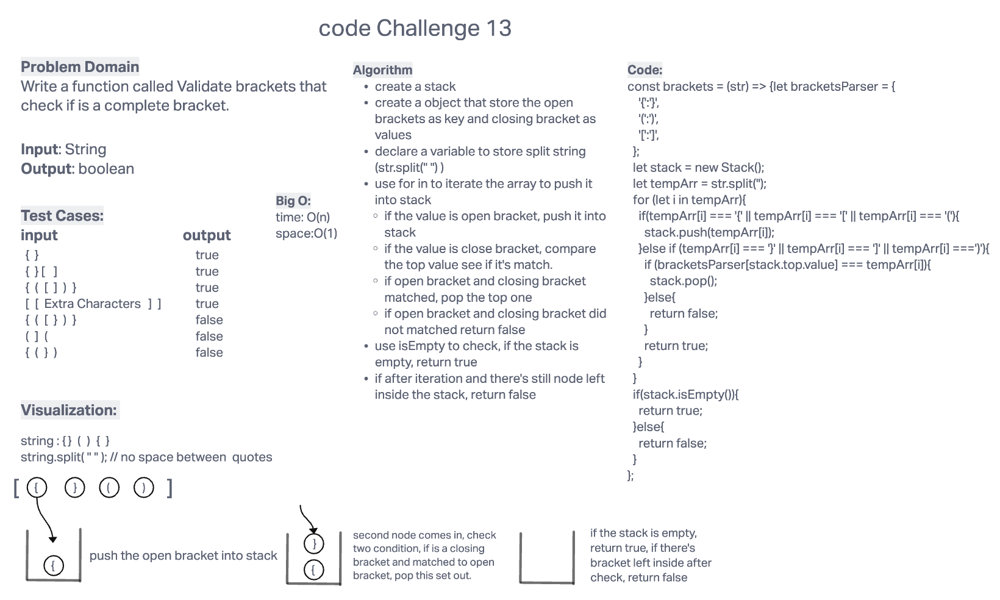

# Challenge Summary

Write a function called Validate brackets that check if is a complete bracket.

## Whiteboard Process

## Approach & Efficiency

Big O :

- time: O(N)
- space: O(1)

## Solution

to run the test, use `npm test stack-queue.test.js`.
