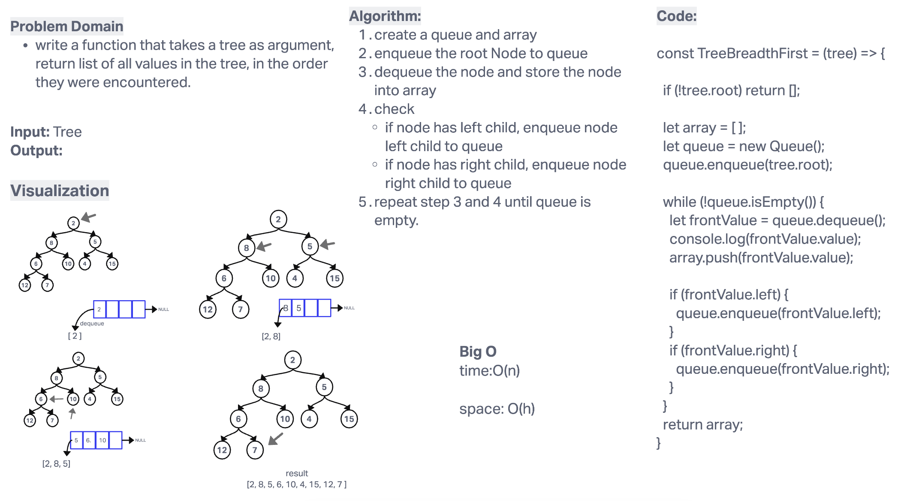

# Tree-breadth-first

### Problem Domain

write a function that takes a tree as argument, return list of all values in the tree, in the order they were encountered.

## Whiteboard Process

## Approach & Efficiency

Big O

- time:O(n)
- space: O(h)

## Solution

to run the test, use `npm test trees-breadth-first.test.js`.