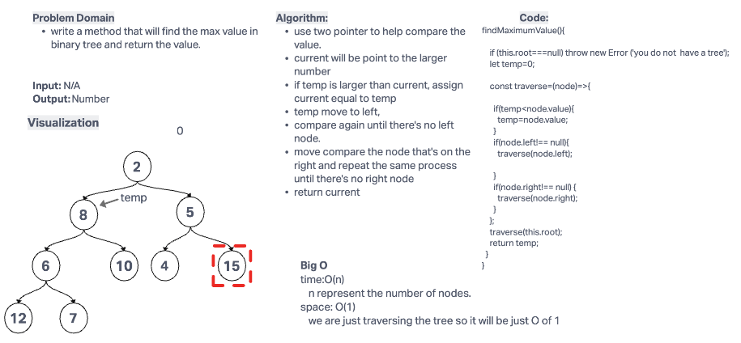

# Challenge Summary

write a method that will find the max value in binary tree and return the value.

## Whiteboard Process

## Approach & Efficiency

Big O

time:O(n)

n represent the number of nodes.

space: O(1)

we are just traversing the tree so it will be just O of 1

## Solution

to run the test, use `npm test trees.test.js`.
